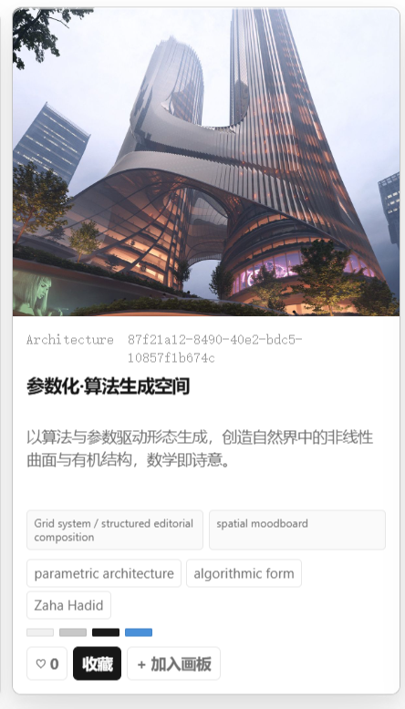
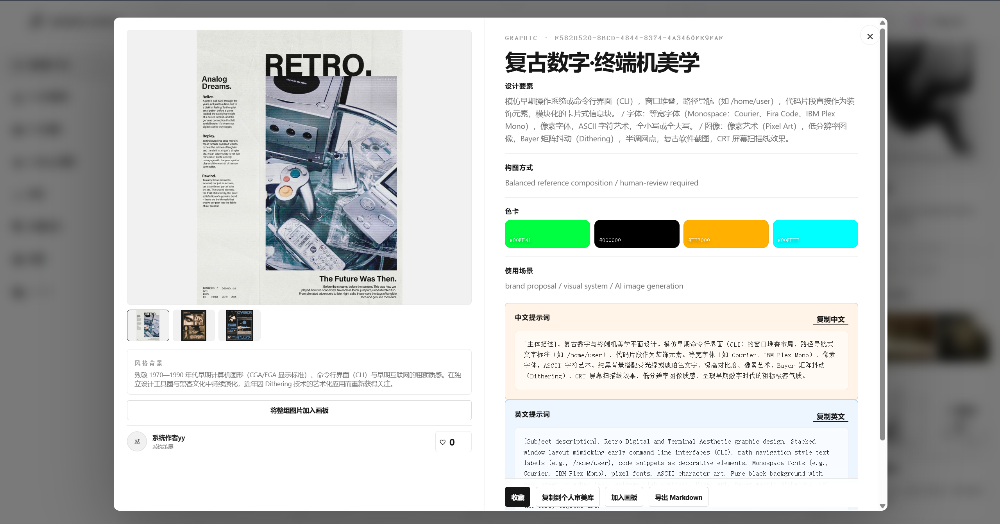
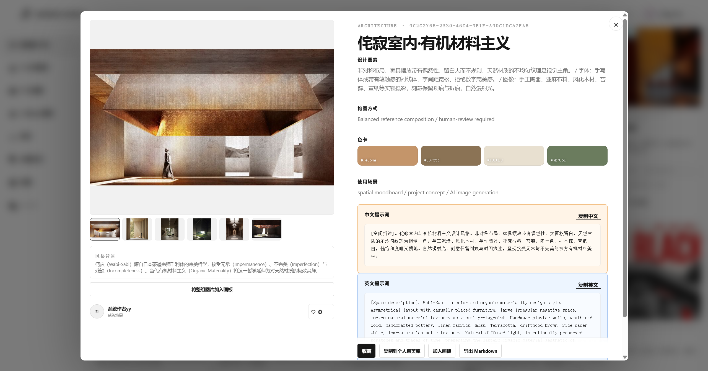

<p align="center"></p>
<h1 align="center">Aesthetic Archive</h1>
<p align="center"><strong>Turn visual references into aesthetic knowledge that can be understood, reused, and compounded.</strong></p>

<p align="center"><a href="https://myaestheticarchive.com">Open the live product</a> · <a href="./README.zh-CN.md">中文 README</a> · <a href="./evals/README.md">Evaluation evidence</a> · <a href="./docs/ai-correction-log.md">AI correction log</a></p>


> **Aesthetic Archive is an AI-assisted aesthetic knowledge base for designers and anyone who cares about visual culture. It turns scattered references into a searchable, traceable, decomposable, and reusable design-intelligence system.**

## Product Introduction

Anyone who cares about aesthetics can accumulate more images than they can meaningfully understand. What is missing is a reliable way to remember why a reference matters, trace where it came from, break down what makes it work, and reuse that knowledge in the next creation, choice, or design project.

Aesthetic Archive treats a reference as more than an image. It creates a structured aesthetic card with design elements, cultural context, materials, lighting, geometry, typography, palette, composition, use cases, bilingual Prompts, negative Prompts, source, and rights information. A one-off save becomes knowledge that remains useful over time.

The product connects four stages that are usually separated:

```text
Reference → Understanding → Aesthetic System → Production Direction
```

It is not another image folder or a generic AI image generator. It is a working knowledge layer between inspiration and design production.


## Who It Is For

- **Spatial designers across planning, architecture, landscape, and interiors:** early research, material studies, spatial references, client presentations, and visual direction.
- **Graphic, brand, and UI designers:** visual systems, editorial references, typography, interfaces, composition, color relationships, and brand moodboards.
- **Photographers and image-makers:** lighting, grading, lens language, visual narrative, atmosphere, and composition.
- **AI visual creators:** repeatable style variables, bilingual Prompts, negative constraints, and reference sets.
- **Personal collectors, design students, and emerging creators:** everyday inspiration, style analysis, visual research, and a long-term personal aesthetic system.
- **Small studios and creative teams:** shared visual language with private project research separated from public inspiration.


## Use Cases

### Before a project

Turn a vague direction such as “quiet, tactile, and architectural” into a vocabulary of materials, light, composition, color, and spatial relationships.

### During visual research

Discover moderated cases in the Public Plaza, search by aesthetic attributes, save references, and compare examples instead of browsing an unstructured image stream.

### During AI-assisted exploration

Upload a reference, analyze what is visible, edit the resulting aesthetic card, and use the bilingual Prompt as a controlled starting point for visual exploration.

### During presentations and collaboration

Arrange references on a Collage Board, add notes and project intent, summarize the visual direction, and prepare a clearer brief for clients or teammates.

### After a project

Preserve the reasoning behind successful references so the next project begins with accumulated knowledge rather than an empty folder.

## Product Modules

### Public Plaza

A moderated public library of aesthetic cases. Browse and search by style, color, composition, scene, use case, and Prompt. Open a case to inspect its analysis, copy Prompts, save it, or add it to a Collage Board.




### Personal Generation and My Archive

Upload a reference or create a card manually in a private archive. Connect an AI Provider through the server-side gateway, generate an analysis, edit the result, and decide whether the card stays private or enters review.


### Aesthetic Cards and Prompt Reuse

Each card keeps the visual reference, design reasoning, cultural context, material language, palette, and composition together. It can produce Chinese and English Prompts, negative Prompts, and reusable style variables, moving from “write a new Prompt every time” to an adaptable Prompt Pack.

The following product screenshots show two real card details: a retro digital terminal system and a wabi-sabi interior with organic material language. They demonstrate how structured analysis and reusable Prompts appear after opening a case from the Plaza.





### Collage Board

Arrange references into a visual board, add notes, define a direction, and summarize relationships between images. The board turns a moodboard into a project-ready visual argument.


### Saved Cases and Templates

Save public references, attach project context, and reuse analysis templates tuned to a discipline, studio method, or personal design vocabulary.

### Review Queue and Messages

AI generation does not automatically make a case public. Admin and reviewer roles approve or reject submissions and retain review history before publication. System messages, Feedback replies, likes, follows, and review results share one notification stream.

## How Generation Works

1. **Choose a reference.** Upload an image, import project material, or create a card manually.
2. **Choose an analysis template.** Select the required depth and design vocabulary.
3. **Generate with a configured Provider.** The authenticated server sends the request through the AI Gateway; Provider keys remain server-side.
4. **Review the result.** Check visible facts, cultural context, inferences, materials, palette, composition, and confidence.
5. **Reuse the output.** Copy a Chinese or English Prompt, adjust the negative Prompt, add the card to a board, or keep it in My Archive.
6. **Publish only when ready.** Private cards remain private; public submissions require reviewer/admin approval.

```text
Collect → Analyze → Edit → Generate Prompt → Arrange → Reuse or Share
```

## Evaluation and Product Judgment

A generated result is not treated as proof of quality. The current reviewable evidence is the A-04 parametric-architecture case. The revised Prompt moved structural constraints into the positive description while retaining negative constraints.

| Version | Language | Best candidate | Interpretation |
|---|---|---:|---|
| v3.0 | Chinese | about 60% | Commercial and fantasy drift; weak parametric identity |
| v3.0 | English | 79.0% | Better structure; unstable setting and skybridges |
| v3.1 | Chinese | 81.2% | Stronger form; commercial lighting remained |
| v3.1 | English | 82.8% | More stable palette, setting, and two-skybridge structure |

These are human-rated best-candidate scores for one controlled case, not automated accuracy or a project-wide average. The rubric, dataset, metadata gaps, and limits are recorded in [`evals/`](evals/README.md).


The implementation also established a firm rule: a plausible-looking result must never replace a real failure. No verified upstream Provider result means no fabricated local AI fallback. Account isolation, privacy, and human review are product boundaries rather than post-launch patches. See [`docs/ai-correction-log.md`](docs/ai-correction-log.md).

## Long-Term Value

Aesthetic Archive is designed to create compounding value rather than one-off AI output.

- **For individuals:** every structured reference makes personal taste more searchable and explainable.
- **For projects:** visual direction becomes a reusable asset instead of disappearing after a presentation.
- **For teams:** shared templates and reviewed cards create a consistent design vocabulary.
- **For the design community:** high-signal public cases can form a more useful knowledge layer than an unstructured image feed.

The long-term loop is: **collect references → build aesthetic knowledge → reuse in production → contribute better cases → strengthen the knowledge base.**


## Product Principles

- **A reference is evidence, not decoration.** Visible facts remain separate from interpretation and uncertainty.
- **AI assists judgment; it does not replace authorship.** Designers control templates, edit cards, and decide what is reusable.
- **Private by default.** Project research and Provider configuration remain protected unless explicitly shared.
- **Explainability over spectacle.** A useful card should show what to notice and how to act on it.
- **Source and rights matter.** Public cases need provenance and rights information; uncertainty stays visible.

## Current Status

| Item | Status |
|---|---|
| Product stage | Public alpha |
| Live product | [myaestheticarchive.com](https://myaestheticarchive.com) |
| Core workflow | Reference → analysis → editable card → Prompt reuse → review |
| Prompt evaluation | One A-04 bilingual controlled case recorded |
| Known limitation | Image workflows may introduce commercial lighting or signage |

## Run Locally

Requirements: Node.js 20+ and pnpm.

```bash
pnpm install --frozen-lockfile
pnpm dev
pnpm check
```

`pnpm check` validates Prompts, workspace contracts, lint, types, repository safety, and the production build. Configuration is documented in [`docs/ENVIRONMENT_TEMPLATE.md`](docs/ENVIRONMENT_TEMPLATE.md). Provider API keys are encrypted server-side and must never enter browser storage, API responses, logs, screenshots, or Git history.

## Technical Foundation and Assets

- `app/`: Next.js pages, APIs, authentication, review, and messaging.
- `lib/`: Supabase clients, validation, Provider vault, AI Gateway, and usage logging.
- `public/local-mvp/`: workspace UI and public case data.
- `public/marketing/` and `public/brand/`: product and workflow visual assets.
- `supabase/migrations/`: schema, RLS, Storage, security, observability, and Feedback migrations.
- `docs/` and `evals/`: product contracts, deployment, QA, evaluation, and correction evidence.

See [`LICENSE`](LICENSE). Code licensing does not grant rights to third-party references, platform-generated outputs, seed content, or user uploads. Confirm rights before public or commercial use.
