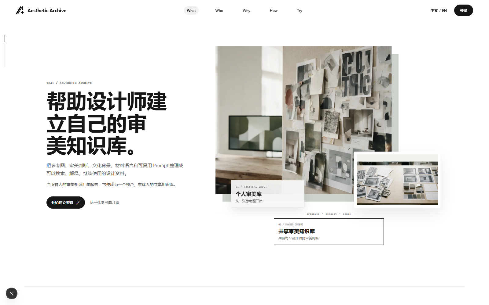
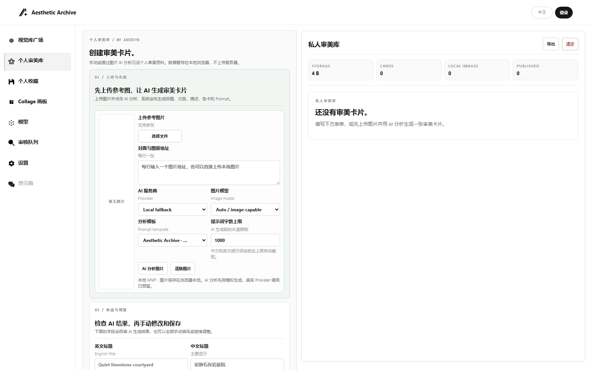
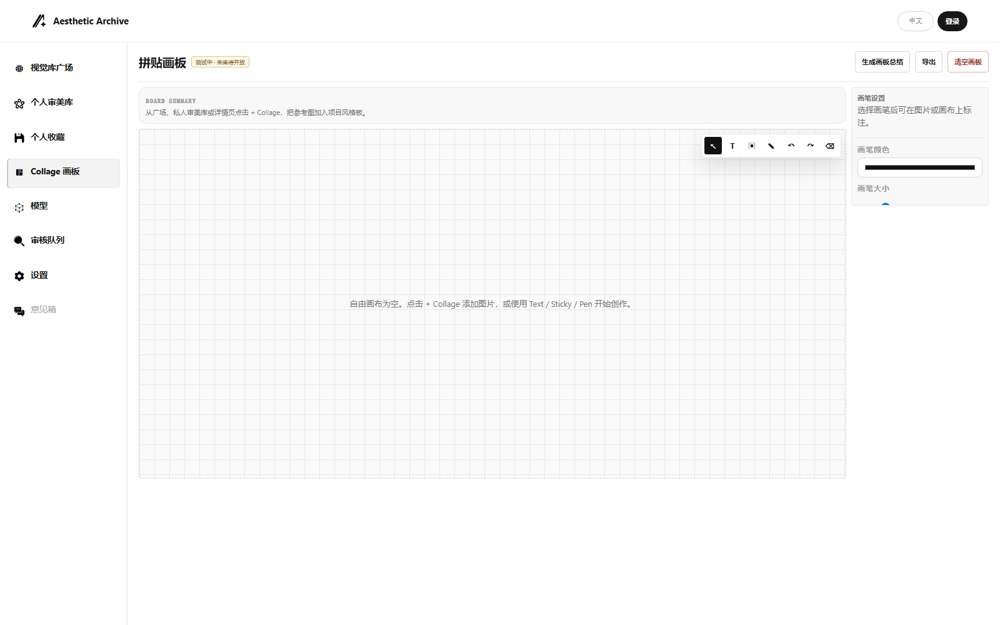

# Aesthetic Archive

[中文 README](README.zh-CN.md) · [Live product](https://myaestheticarchive.com) · [Evaluation evidence](evals/README.md) · [AI correction log](docs/ai-correction-log.md)

> An AI-assisted aesthetic knowledge base that turns visual references into structured, explainable, and reusable design knowledge.



## Status

| Item | Status |
|---|---|
| Product stage | Public alpha |
| Live product | Available |
| Core workflow | Reference → analysis → editable card → Prompt reuse → review |
| Prompt evaluation | One A-04 bilingual controlled case recorded |
| Evaluation coverage | Case-level evidence; additional domains pending |
| Known limitation | Image workflows may introduce commercial lighting or signage |

## The Product Decision

Designers can save thousands of references and still lose the reasoning that made them useful. Aesthetic Archive treats each image as evidence: it separates visible facts, interpretation, uncertainty, design variables, source, and rights information, then turns that structure into an editable aesthetic card and reusable bilingual Prompt asset.

The product is not a generic image folder or a one-click image generator. It is a knowledge layer between inspiration and production:

```text
Reference → Understanding → Aesthetic System → Production Direction
```

Three boundaries shape the product:

- AI output remains editable; it is not treated as final fact.
- Prompt quality is tested with controlled candidates and recorded failure reasons.
- Private cards stay private, and public submissions require human review.

## What I Built

This is an independently built product developed with AI coding-agent assistance. My contribution covers problem framing, the card knowledge model, the four-stage workflow, Prompt evaluation criteria, privacy and review boundaries, acceptance testing, and release decisions.

| Product decision | Implementation evidence |
|---|---|
| Turn references into reusable knowledge | Structured cards, bilingual Prompts, negative constraints, source and rights fields |
| Keep generation accountable | Editable output, Provider Gateway, usage records, explicit failure states |
| Test Prompt quality | Four-dimension weighted rubric and 70% per-dimension gate |
| Protect private research | Supabase RLS, workspace isolation, private-by-default cards |
| Prevent automatic public AI content | Reviewer/admin queue and audit trail |

## Evidence, Not Claims

The current controlled evidence is the A-04 parametric-architecture case. The revised Prompt moved structural constraints into the positive description while retaining negative constraints.

| Version | Language | Best candidate | Interpretation |
|---|---|---:|---|
| v3.0 | Chinese | about 60% | Commercial and fantasy drift; weak parametric identity |
| v3.0 | English | 79.0% | Better structure; unstable setting and skybridges |
| v3.1 | Chinese | 81.2% | Stronger form; commercial lighting remained |
| v3.1 | English | 82.8% | More stable palette, setting, and two-skybridge structure |

These are human-rated best-candidate scores for one controlled case, not automated accuracy or a project-wide average. The rubric, metadata gaps, and limits are recorded in [`evals/`](evals/README.md).


The raw development images retain platform watermarks and are included only as evaluation evidence, not licensed production artwork.

## What the AI Got Wrong

The implementation process exposed the same product discipline repeatedly: the product must not replace a real failure with a plausible fiction.

- An unvalidated extraction refactor was reverted in about 40 seconds because generation-quality changes must pass a representative sample before entering the main path.
- Provider debugging produced a “solved” state without a verified upstream result; the resulting rule forbids fabricated local AI output as a fallback.
- An account-isolation incident led to stricter RLS and workspace acceptance criteria.
- The evaluation framework is structured with AI assistance, but candidate scoring is explicitly human-rated and case-level.

The full, verifiable account is in [`docs/ai-correction-log.md`](docs/ai-correction-log.md).

## Core Workflow

1. Collect or upload a visual reference.
2. Choose an analysis template and generate through a configured Provider.
3. Review visible facts, interpretations, materials, palette, composition, and confidence.
4. Edit the card and its Chinese/English Prompts.
5. Reuse it in generation or arrange it on a Collage Board.
6. Keep it private or submit it to the moderated Public Plaza.

## Product Surfaces

- **Public Plaza:** reviewed public cases with search, saves, and source context.
- **My Archive:** private generation, manual cards, editing, and Provider configuration.
- **Prompt reuse:** bilingual Prompts, negative constraints, and reusable templates.
- **Collage Board:** references, notes, and project direction in one visual workspace.
- **Review Queue:** reviewer/admin acceptance before public publication.





## Known Limits

- Current Prompt evidence covers one validated case; landscape, interior, and graphic cases are pending.
- Historical Provider and model metadata for A-04 was not fully recorded.
- Human-rated scores make the protocol reviewable, not objectively universal.
- Provider workflows may add unrequested commercial lighting, signage, or scene elements.
- Public seed-image redistribution rights must be confirmed before commercial launch.
- The architecture is intentionally broader than a static MVP because private workspaces, review, Provider secrets, and public content require separate trust boundaries.

## Run Locally

Requirements: Node.js 20+ and pnpm.

```bash
pnpm install --frozen-lockfile
pnpm dev
```

Run the complete repository acceptance check:

```bash
pnpm check
```

This validates seed Prompts, workspace contracts, lint, types, repository safety, and the production build. Key framework and type dependencies are pinned to the versions resolved by the lockfile.

## Technical Foundation

- `app/`: Next.js pages, APIs, authentication, and product surfaces.
- `lib/`: validation, Supabase clients, Provider vault, AI Gateway, and usage logging.
- `supabase/migrations/`: schema, RLS, storage, review, and observability.
- `evals/`: Prompt rubric, datasets, and results.
- `docs/`: product contracts, deployment, QA, decisions, and correction evidence.

Provider keys are encrypted and stored server-side. They must never appear in browser storage, API responses, logs, screenshots, or Git history. See [`docs/ENVIRONMENT_TEMPLATE.md`](docs/ENVIRONMENT_TEMPLATE.md) for configuration.

## License and Assets

See [`LICENSE`](LICENSE). Code licensing does not grant rights to third-party reference images, generated platform outputs, seed content, or user uploads. Confirm redistribution rights before public or commercial use.
