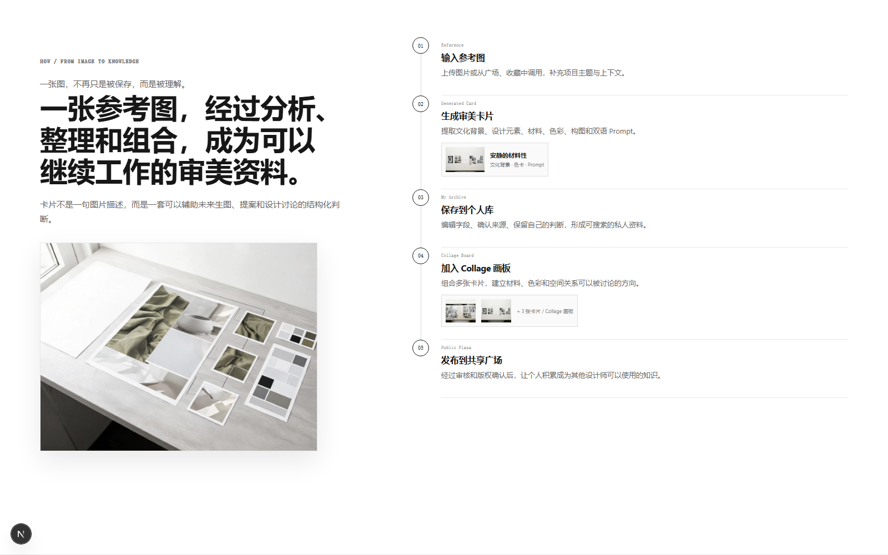
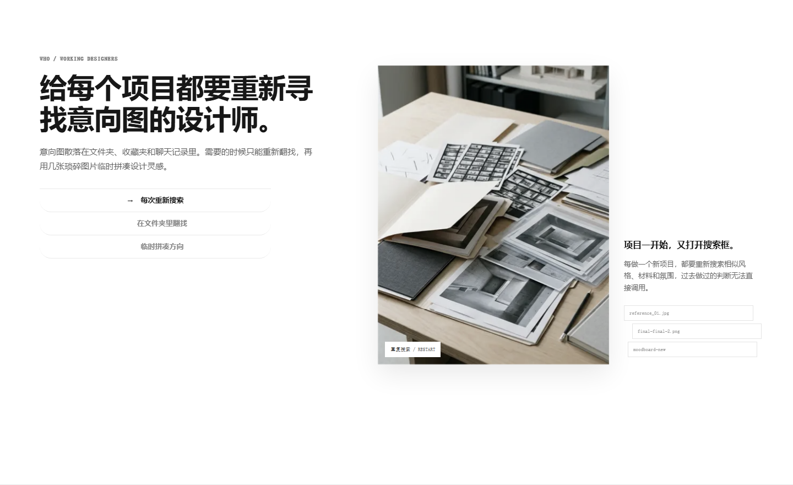
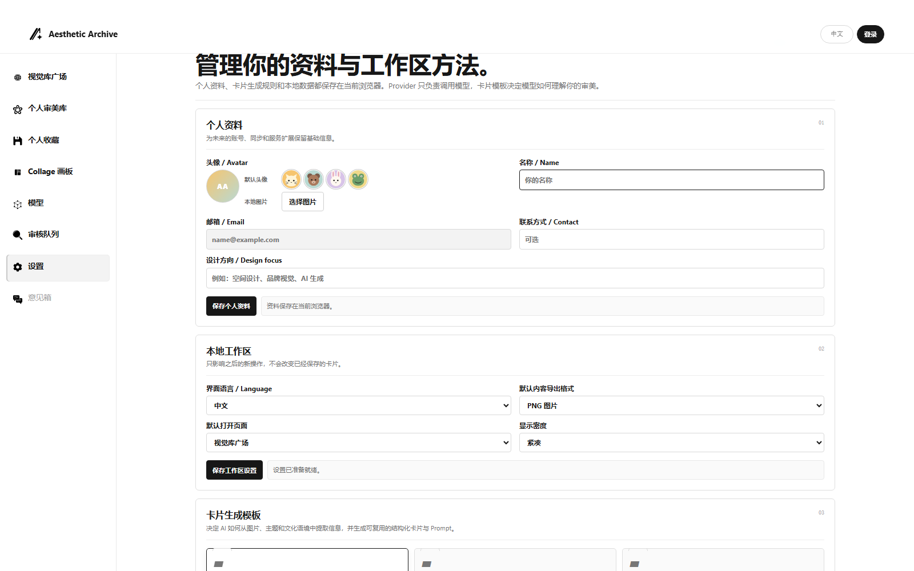

# Aesthetic Archive

[English README](./README.md)

**产品网址：** [https://aesthetic-archive.laverneyue33.workers.dev](https://aesthetic-archive.laverneyue33.workers.dev)


> **Aesthetic Archive 是一个面向所有审美者/设计师的 AI 审美知识库：把分散的视觉参考转化为可搜索、可溯源、可拆分、可复用的设计审美智能系统。**

## 产品介绍

每一个关注审美的人都可能收藏大量图片，真正缺少的是一种可靠的方法：记住一张参考图为什么重要，追溯它来自哪里，拆分它为什么有效，并把其中的知识带入下一次创作、选择或设计项目。

Aesthetic Archive 不把参考图当作单纯的图片，而是把它转化为结构化审美卡片，记录设计元素、文化语境、材料、光线、几何、字体、色彩、构图、使用场景、双语 Prompt、Negative Prompt、来源和版权信息。无论是专业项目还是个人审美积累，视觉参考都能从一次性收藏转化为可以持续使用的知识。

产品连接了通常彼此分离的四个阶段：

```text
参考图 → 理解 → 审美体系 → 设计生产方向
```

它不是另一个图片文件夹，也不是泛化的 AI 生图工具，而是连接灵感与设计生产之间的一层可工作的知识系统。



## 针对用户

Aesthetic Archive 面向所有希望建立、理解和复用审美知识的人：

- **空间设计师（规划、建筑、景观、室内）：** 前期研究、材料分析、空间参考、客户汇报和视觉方向。
- **平面、品牌与 UI 设计师：** 视觉系统、编辑参考、字体、界面、构图、色彩关系和品牌 Moodboard。
- **摄影师与影像创作者：** 积累光线、色调、镜头语言、叙事氛围和构图参考。
- **AI 视觉创作者：** 建立可重复的风格变量、双语 Prompt、负向约束和参考集合。
- **个人审美收藏者、设计学生与新晋创作者：** 整理日常灵感，拆解风格，进行视觉研究，并长期建立自己的审美体系。
- **小型工作室与创意团队：** 建立共享视觉语言，同时将项目研究与公开灵感分开管理。



## 使用场景

### 项目开始之前

收集来自不同来源的参考图，把“安静、触感强、有建筑感”这类模糊方向，转化为材料、光线、构图、色彩和空间关系组成的视觉词汇。

### 进行视觉研究时

通过视觉库广场发现经过整理的案例，按审美属性搜索，保存有价值的参考，并进行对比，而不是在没有结构的图片流中反复浏览。

### 进行 AI 辅助探索时

上传参考图，让系统分析图中可观察到的内容，编辑生成的审美卡片，并将双语 Prompt 作为视觉探索的起点。

### 进行汇报与协作时

在 Collage 画板中排列参考图，添加笔记和项目意图，总结视觉方向，为客户或团队准备更清晰的设计 Brief。

### 项目结束之后

保留成功参考背后的判断逻辑，让下一次项目从不断积累的知识开始，而不是重新打开一个空文件夹。

## 具体功能

### 视觉库广场 / Public Plaza

经过审核的公开审美案例库。可以按风格、色彩、构图、场景、使用场景和 Prompt 浏览与搜索，打开案例查看结构化分析，复制 Prompt、收藏案例或加入 Collage 画板。


### 个人生成与个人审美库 / My Archive

在私人审美库中上传参考图或手动创建卡片。通过服务端 AI Gateway 连接自定义 AI Provider，生成分析结果，编辑卡片内容，并决定保持私有或提交审核。


### 提示词复用 / Prompt Reuse

每张分析卡片都可以生成中文 Prompt、英文 Prompt、Negative Prompt 和可复用的风格变量。目标是从“每次重新写一遍 Prompt”转向可以跨项目、跨工具调整的 Prompt Pack。用户可以在个人设置中选择已有的 Prompt 生成模板，也可以自行填写和维护模板。生成表单和可编辑审美卡片将分析、双语 Prompt、模板复用与审美库保存整合在同一条工作流中。



### 画板 / Collage Board

将参考图排列为视觉画板，添加笔记，定义设计方向，并总结图片之间的关系。画板的目标不是停留在氛围展示，而是形成可以用于项目沟通的视觉论证。


### 收藏与模板 / Saved and Templates

保存公开案例，添加项目语境，并复用分析模板。模板可以按照专业方向、工作室方法或个人描述视觉判断的方式进行调整。

### 审核队列 / Review Queue

AI 生成并不等于可以自动公开。Admin 和 Reviewer 可以查看提交内容、通过或驳回案例，并保留审核记录，之后卡片才会进入视觉库广场。

## 如何使用生成

1. **选择参考图。** 上传图片、导入项目参考，或手动创建卡片。
2. **选择分析模板。** 根据需要选择分析深度和设计词汇。
3. **使用已配置的 Provider 生成。** 认证后的服务端会通过 AI Gateway 发起请求，Provider 密钥只保留在服务端。
4. **检查生成结果。** 核对可见事实、文化背景、推测、材料、色彩、构图和置信度，并修正需要调整的内容。
5. **复用结果。** 复制中文或英文 Prompt，调整 Negative Prompt，将卡片加入画板，或保存到个人审美库。
6. **确认后再公开。** 私有卡片保持私有，公开提交必须经过 reviewer/admin 审核后才能进入视觉库广场。

生成循环是：

```text
收集 → 分析 → 编辑 → 生成 Prompt → 排列 → 复用或分享
```

## 长期价值

Aesthetic Archive 追求的是持续积累的价值，而不只是一次性的 AI 输出。

- **对个人：** 每一张结构化参考图都会让个人审美更容易搜索和解释。
- **对项目：** 视觉方向会成为可以复用的设计资产，而不是在汇报结束后消失。
- **对团队：** 共享模板和审核案例能够建立一致的设计语言。
- **对设计社区：** 高信噪比的公开案例可以形成比无结构图片流更有用的审美知识层。
- **对未来产品：** 审美库可以支持设计教育、协作、研究和更有纪律的 AI 辅助创作。

长期产品循环是：

**收集参考 → 建立审美知识 → 用于生产 → 贡献更好的案例 → 强化知识库。**


## 产品原则

- **参考图是证据，不是装饰。** 将可观察事实与判断、推测和不确定性分开。
- **AI 辅助判断，不替代作者。** 设计师控制模板、编辑卡片，并决定什么值得复用。
- **默认保护隐私。** 项目研究和 Provider 配置受到保护，只有明确分享后才会公开。
- **解释优先于炫技。** 一张有用的卡片应该告诉设计师该观察什么，以及下一步如何行动。
- **来源和版权同样重要。** 公开案例需要来源和版权信息，不确定的判断必须保持不确定标记。
- **审美知识应该持续复利。** 每一张结构化参考图，都应该让下一个项目更快、更有依据。

## 本地运行

要求：Node.js 20+、pnpm。

```bash
pnpm install --frozen-lockfile
pnpm dev
```

提交 Pull Request 前执行：

```bash
pnpm check
```

该命令会执行 lint、类型检查、仓库安全检查和生产构建。

## 技术基础

- `app/`：Next.js 页面、服务端 API、认证回调和宣传页样式。
- `lib/`：Supabase 客户端、校验、Provider 加密存储、AI Gateway 和使用记录。
- `public/local-mvp/`：浏览器工作区界面和公开案例数据。
- `public/marketing/`、`public/brand/`：产品资源和工作流视觉素材。
- `supabase/migrations/`：数据库、RLS、Storage、安全、可观测性和反馈迁移。
- `docs/`：产品契约、设置、部署、QA 和发布文档。

根目录是唯一的应用目录，不再使用 `apps/web` 路径。

## 配置与安全

根据 `.env.example` 创建本地 `.env.local`。不要提交 `.env.local` 或任何密钥文件。

必须配置：

- `NEXT_PUBLIC_SUPABASE_URL`
- `NEXT_PUBLIC_SUPABASE_ANON_KEY`
- `SUPABASE_SERVICE_ROLE_KEY`
- `PROVIDER_ENCRYPTION_KEY`：Base64 编码的 32 字节密钥

可选运行时配置：

- `AI_REQUEST_TIMEOUT_MS`

生产环境通过 Cloudflare 出站 `fetch` 调用 Provider，不要在 Worker 中配置桌面代理变量。Provider API Key 只在服务端加密保存，绝不能出现在 localStorage、浏览器备份、API 响应、日志或 Git 历史中。浏览器只能获得 `hasSecret` 等非敏感元数据。

## 图片资源与许可证

请阅读 `LICENSE`。商业上线前，确认所有公开案例图片都属于自有、已授权或公共领域资源；不要发布未经确认授权的参考图、私人浏览器导出、截图或临时 QA 素材。
